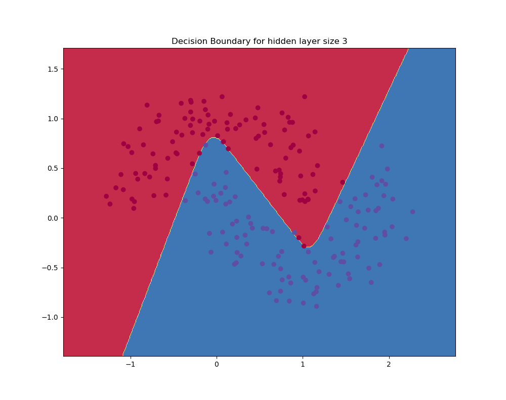
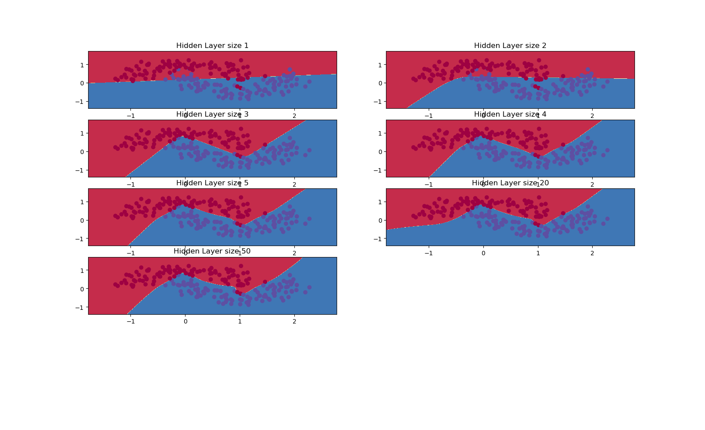

# primero-NN
Implementing a Neural Network from Scratch in Python.

## Data Generation
The dataset we generated has two classes, plotted as red and blue points. You can think of the blue dots as male patients and the red dots as female patients, with the x- and y- axis being medical measurements.

## Plot with Hidden Layer size 3

We can see that our neural network was able to find a decision boundary that successfully separates the 2 classes.

## Comparison of different Hidden Layer sizes

We can see that a hidden layer of low dimensionality nicely captures the general trend of our data. Higher dimensionalities are prone to overfitting. They are “memorizing” the data as opposed to fitting the general shape. If we were to evaluate our model on a separate test set, the model with a smaller hidden layer size would likely perform better due to better generalization.
