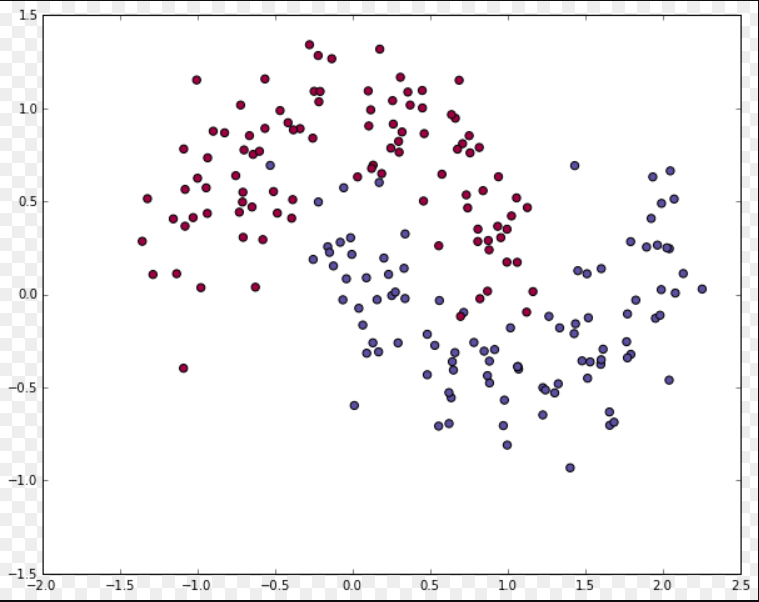

# primero-NN
Implementing a Neural Network from Scratch in Python.

## Data Generation
The dataset we generated has two classes, plotted as red and blue points. You can think of the blue dots as male patients and the red dots as female patients, with the x- and y- axis being medical measurements.

